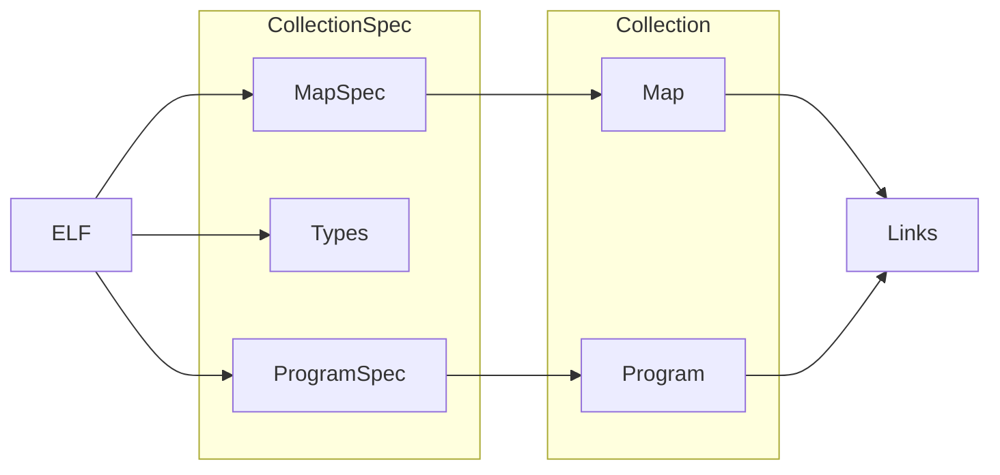

# Loading Objects

{{ proj }} ships an eBPF object (ELF) loader that aims to be compatible with the
upstream libbpf and iproute2 (`tc`/`ip`) projects. An ELF is typically obtained
by compiling a eBPF C program using the LLVM toolchain (`clang`).

This page describes the journey from compiled eBPF ELF to resources in the
kernel. This involves parsing the ELF into intermediate Go (Spec) types that
can be modified and copied before loading them into the kernel.

## {{ godoc('CollectionSpec') }}

A CollectionSpec represents eBPF objects extracted from an ELF, and can be
obtained by calling {{ godoc('LoadCollectionSpec') }}. In the examples below, we
declare a Map and Program in eBPF C, then load and inspect them using Go. Use
the tabs to explore the Go and C counterparts below.

=== ":simple-go: Go"
    {{ go_example('DocLoadCollectionSpec', title='Parse ELF and inspect its CollectionSpec') | indent(4) }}

    !!! warning ""
        All of a Spec's attributes can be modified, and those modifications
        influence the resources created in the kernel. Be aware that doing so
        may invalidate any assumptions made by the compiler, resulting in maps
        or programs being rejected by the kernel. Proceed with caution.

=== ":ebee-color: eBPF C"
    {{ c_example('DocMyMapProgram', title='Declare a minimal map and a program') | indent(4) }}

    !!! tip ""
        See [Section Naming](section-naming.md) to learn about the use of the
        `SEC()` macro in the example above.

## {{ godoc('NewCollection') }}

After parsing the ELF into a CollectionSpec, it can be loaded into the kernel
using {{ godoc('NewCollection') }}, resulting in a {{ godoc('Collection') }}.

{{ go_example('DocNewCollection') }}

!!! note ""
    {{ godoc('Collection.Close') }} closes all Maps and Programs in the
    Collection. Interacting with any resources after `Close()` will return an
    error, since their underlying file descriptors will be closed. See [Object
    Lifecycle](object-lifecycle.md) to gain a better understanding of how {{
    proj }} manages its resources and for best practices handling Maps and
    Programs.

## {{ godoc('CollectionSpec.LoadAndAssign', short=True) }}

LoadAndAssign is a convenience API that can be used instead of `NewCollection`.
It has two major benefits:

- It automates pulling Maps and Programs out of a Collection. No more `#!go if m
  := coll.Maps["my_map"]; m == nil { return ... }`.
- **Selective loading of Maps and Programs!** Only resources of interest and
  their dependencies are loaded into the kernel. Great for working with large
  CollectionSpecs that only need to be partially loaded.

First, declare a struct that will receive pointers to a Map and a Program after
loading them into the kernel. Give it a `#!go Close()` method to make cleanup
easier.

{{ go_example('DocLoadAndAssignObjs', title='Declare a custom struct myObjs') }}

!!! note ""
    Use bpf2go if the preceding code snippet looks
    tedious. bpf2go can generate this kind of boilerplate code automatically
    and will make sure it stays in sync with your C code.

Next, instantiate a variable of our newly-declared type and pass its pointer to
`LoadAndAssign`.

{{ go_example('DocLoadAndAssign', title='Pass a custom struct to LoadAndAssign') }}

!!! warning ""
    If your use case requires dynamically renaming keys in CollectionSpec.Maps,
    you may need to use NewCollection instead. Map and Program names in struct
    tags are baked into the Go binary at compile time.

## Type Information (BTF)

If an eBPF ELF was built with `clang -g`, it will automatically contain BTF type
information. This information can be accessed programmatically through {{
godoc('CollectionSpec.Types') }}. Note that this field will be `nil` if the ELF
was built without BTF.

{{ go_example('DocBTFTypeByName') }}

!!! note ""
    Many eBPF features rely on ELFs to be built with BTF, and there is
    little to be gained by opting out of it. `clang -g` also includes DWARF
    information in the ELF which can be safely removed with `llvm-strip`. eBPF
    does not rely on DWARF information.
