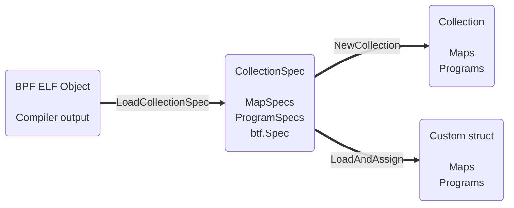

# Loading Objects

{{ proj }} ships with a fully-featured eBPF object (ELF) loader that aims to be compatible with the upstream libbpf and
iproute2 (`tc`/`ip`) projects. An ELF is usually obtained by compiling a eBPF C program using the LLVM toolchain
(`clang`).

This page describes the journey from compiled eBPF ELF to resources in the kernel. This involves parsing the ELF into
intermediary Go (Spec) types which can be freely modified and copied before handing them off.

## {{ godoc('CollectionSpec') }}

A CollectionSpec represents eBPF objects extracted from an ELF, and can be obtained by calling {{
godoc('LoadCollectionSpec') }}. In the examples below, we declare a map and program in eBPF C,
then load and inspect them using Go. Use the tabs to explore the Go and C counterparts below.

=== "Go"
    {{ go_example('DocLoadCollectionSpec', title='Parse ELF and inspect its CollectionSpec') | indent(4) }}

    !!! danger
        All of a Spec's attributes can be modified freely, and those modifications will influence the resources created
        in the kernel. Be aware that doing so may invalidate any assumptions made by the compiler, resulting in maps or
        programs being rejected by the kernel. Proceed at your own caution.

=== "eBPF C"
    {{ c_example('DocMyMapProgram', title='Declare a minimal map and a program') | indent(4) }}

    !!! tip
        See the [ELF Sections](elf-sections) page to learn about the use of the `SEC()` macro in the example above.

## {{ godoc('Collection') }}

After parsing the ELF into a CollectionSpec, it can be loaded into the kernel in its entirety using
{{ godoc('NewCollection') }}.

{{ go_example('DocNewCollection') }}

!!! info
    {{ godoc('Collection.Close') }} closes all Maps and Programs in the Collection. Interacting with any resources
    after `Close()` will return an error, since their underlying file descriptors will be closed. See
    [Object Lifecycle](object-lifecycle) to gain a better understanding of how {{ proj }} manages its resources
    and how to best handle Maps and Programs throughout the lifecycle of your application.

## {{ godoc('CollectionSpec.LoadAndAssign', short=True) }}

LoadAndAssign is a convenience API that can be used instead of `NewCollection`. It has two major benefits:

- It automates away any validation logic around pulling Maps and Programs out of a Collection. No more
  `#!go if m := coll.Maps["my_map"]; m == nil { return ... }`.
- **Selective loading of Maps and Programs!** Only resources of interest (and their dependencies) are loaded into the
  kernel. A powerful tool for working with large CollectionSpecs that only need to be partially loaded.

{{ go_example('DocLoadAndAssign', title='Pass a custom struct to LoadAndAssign') }}

As can be seen from the example above, this comes with a few limitations:

- You're responsible for calling `#!go Close()` on any resources assigned to your custom struct. (Implement your own
  `#!go Close()` method!)
- Slightly less runtime flexibility. Map and Program names are baked into the custom struct at compile time, so renaming
  keys in e.g. CollectionSpec.Maps will not work. This is a niche use case, however.

## Type Information (BTF)

If an eBPF ELF was built with `clang -g`, it will automatically contain BTF type information. This information
can be accessed programmatically through {{ godoc('CollectionSpec.Types') }}. Note that this field will be `nil` if the
ELF was built without BTF.

{{ go_example('DocBTFTypeByName') }}

!!! tip
    Many modern eBPF features rely on eBPF ELFs to be built with BTF information, and there is little to be gained by
    opting out of it. Most sections in this documentation will assume objects are built with `clang -g`.
